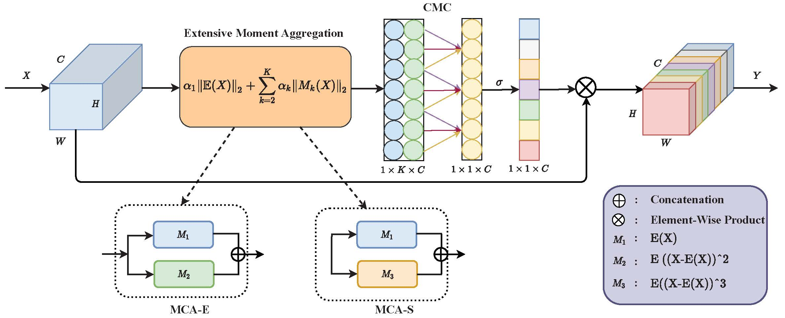

## The code of "MCA: Moment Channel Attention Networks"

##  Framework of MCA


## 🖊️ Citation


If you find this project useful in your research, please consider cite:

```BibTeX
@inproceedings{zhang2024improving,
  title={Improving the generalization of segmentation foundation model under distribution shift via weakly supervised adaptation},
  author={Zhang, Haojie and Su, Yongyi and Xu, Xun and Jia, Kui},
  booktitle={Proceedings of the IEEE/CVF Conference on Computer Vision and Pattern Recognition},
  pages={23385--23395},
  year={2024}
}
